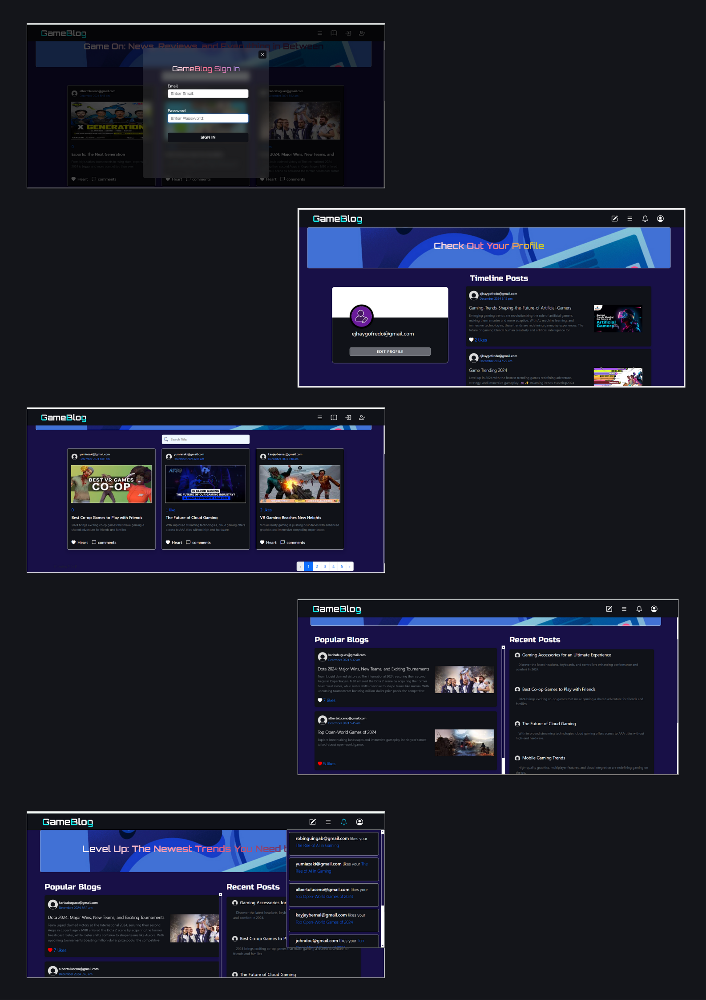

# GameBlog - A Dynamic Blog Website

## Overview 📌  
**GameBlog** is an engaging platform for gaming enthusiasts to sign up, log in, and immerse themselves in a world of gaming content. Users can create and share posts, interact by liking content, and receive notifications. Explore trending blogs, stay updated with the latest game news, and discover a wide range of game-related posts. Whether you want to share your gaming experiences or keep up with the community, GameBlog is your go-to destination for everything gaming.

## Features 📌  

- Popular Blogs: 
  - A curated list showcasing the most popular and engaging blogs in the gaming world. This section highlights top-rated content based on user engagement and relevance to trending topics. Users can explore these blogs to stay on top of the latest discussions and developments in the gaming industry.

- Recent Blogs:
  - A dynamic feed displaying the latest posts published by users across various gaming topics. This section is designed to keep users informed about fresh content and help them engage with the newest contributions from the community.

- About Us: 
  - This section provides detailed information about the **GameBlog** platform . The goal of GameBlog is to foster a thriving community of gamers, creators, and enthusiasts by offering a space for collaboration, sharing, and discovery.

- Authenticated User 
  - Timeline: 
    - Users can easily access and view all of their own posts in one place, providing a personal feed where they can track content.
  
  - Notifications:
    - Users receive instant notifications whenever their posts receive likes interaction. This feature allows users to stay connected with their community and engage with content that matters most. They can navigate directly to the posts that have received likes, making the interaction process more seamless.

  - Write Post:
    - The platform enables users to share their thoughts, reviews, and insights about games, trends, and gaming culture. Whether it's a review of the latest release, a personal gaming experience, or a trend analysis, users can easily create and publish content that resonates with the gaming community.

  - Login/Logout

 ## Tech Stack 📌
- **Frontend**: HTML(BLADE), CSS, Bootstrap, Livewire
- **Backend**: Laravel
- **Database**: MySQL
